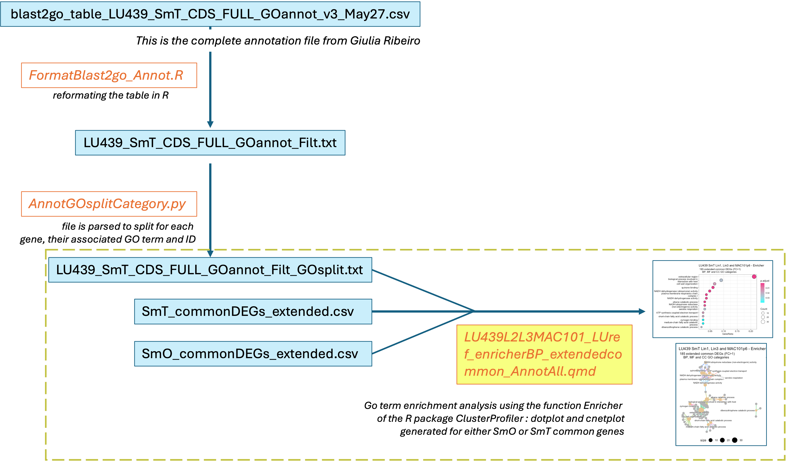
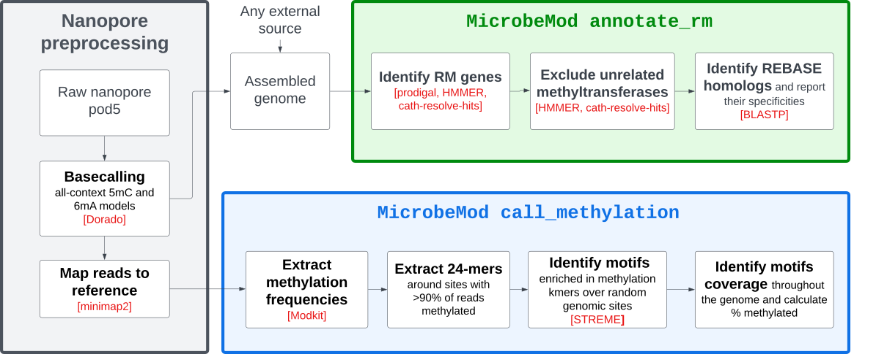

```{r setup, include=FALSE}
knitr::opts_chunk$set(echo = TRUE)
```

# Description of the project

The project was focused on *Mycobacterium avium* complex, a group of nontuberculous mycobacteria causing opportunistic in humans. *M. avium* are highly resistant to antitibiotics and treatments of patients is challenging. *M. avium* has the characteristics of exhibiting different colony morphologies when grown on agar plates, which virulence and drug sensitivity variation. These bacteria can reversibly switch between the smooth opaque (SmO) and transparent (SmT) form by a yet unknown mechanism. The aim of the project was to investigate the gene expression of the two colony morphologies and their methylome to get insights into the mechanisms of colony switching in M. avium.

More specifically, during this project was performed:

1\) Functional RNAseq analysis of SmO versus SmT samples of LU439 and MAC101 strains (Volcano plots, GO enrichment and GO term clustering analysis, differentially expressed genes heatmaps)

2\) DNA methylation analysis of *M. avium* and start looking whether SmO and SmT samples show variation in their methylome patterns and if so, evaluate if variation occurs for differentially expressed genes.

LU439 SmO and SmT genomes were aleady available from previous work. But for MAC101, only a genome at the contig level was on NCBI, and not separated between SmO and SmT phenotypes. For this project, genome assembly was performed using short and long reads sequencing, genomic comparison and annotation were done for this second strain.

The computations/data handling were enabled by resources provided by the National Academic Infrastructure for Supercomputing in Sweden (NAISS), partially funded by the Swedish Research Council through grant agreement no. 2022-06725.


Scripts only described by name in the Readme are found in the script folder.

# PART A - Functional analysis of RNA sequencing data

## 1 - Volcano plot of the differentially expressed genes

The input data table used for the plot is the output table from the DESeq2 analysis performed by Giulia Ribeiro, according to the following pipeline: (Image by Giulia Ribeiro):

{width="638"}

Volcano plot was performed using R scripts, which can be found as a quarto documents for:

=\> M. avium strain LU439 SmT1 versus SmO2 RNAsequencing analysis ("VolcanoRNAseq_LU439L2_annottop10_ok.qmd").

## 2 - Identify Differentially expressed genes common between the 3 RNAseq data sets

RNA sequencing analysis using the same genome (strain LU439 SmT1) as the reference for easier comparison has been performed for :

-   strain LU439 SmT1 vs SmO2
-   strain LU439 SmT3 vs SmO3
-   strain MAC101 SmT vs SmO

## 3 - Gene ontology (GO) enrichment analysis

Analysis was performed on the common DEGs identified between the two strains for either SmO or SmT bacteria.

This work used a combination different R or Python scripts according to the following pipeline:

{fig-align="center" width="478"}

GO enrichment analysis was done using the R script to generate a dotplot graph, and clustering of GO terms identified was visualized as a cnetplot:

"LU439L2L3MAC101_LUref_enricherBP_extendedcommon_AnnotAll.qmd". Analysis was done using the package ClusterProfiler, enricher function.

## 4 - Heatmap of relative expression of the DEGs falling into the main enriched GO terms

Enriched GO terms were obtained for differentially expressed genes, shared between LU439 and MAC101 strains.

For the SmT bacteria, two main clusters of GO terms could be observed, for which the DEGs were recovered and their corresponding relative expression was plotted in a heatmap, using the package pheatmap. The heatmap was done for MAC101 RNAseq samples, using the R script "Heatmap_SmT_GOBPextendedCommonDEG_MAC101T_normMatrix.qmd".

Input data for this analysis is the output table from the Htseq counts obtained during Differential gene expression analysis, done by Giulia Ribeiro.

# PART B - DNA Methylation analysis

This part of the work was performed using the High Performance Computing system Uppmax. sbatch scripts were submitted using SLURM commands

``` bash
# Working using a Conda Environment
conda create --name <GiveANameOfYourEnvironment>
conda activate <NameOfYourEnvironment>
conda deactivate
# Knowing the list of environments created
conda env list
```

## 1 - Genome Assembly

Several samples from MAC101 bacteria, either SmO or SmT were available:

| Sample names              | Illumina short reads | ONT long reads (including Pod5 data) |
|-----------------------|-------------------|------------------------------|
| SmOp6                     | X                    |                                      |
| SmO replicate 1 (MAC242)  |                      | X (yes)                              |
| SmO replicate 3 ( MAC251) |                      | X (yes)                              |
| SmTp6                     | X                    |                                      |
| SmT replicate 1 (MAC257)  |                      | X (yes)                              |
| SmT replicate 3 (MAC278)  |                      | X (yes)                              |
| SmT replicate 4 (MAC289)  |                      | X (no)                               |

The approach used for genome assembly, based on prior work on a different *M. avium* strain, was to use a hybrid assembly with short and long reads, and the tool Unicycler.

### a - Quality checks

-   short Illumina reads using FastQC

``` bash
#!/bin/bash

#SBATCH -J fastqc
# to give another name for the job rather that the job ID

#SBATCH -o result_fastqc_out_%j.out
# if you want to specify a name - otherwise it will be the default slurmJobID.out
# optional

#SBATCH -e error_fastqc_out_%j.err
# if you want to specify the errors in a distinct file
# optional

#SBATCH -t 01:00:00
# specify the time needed

#SBATCH -A naiss2023-22-1171
# specify the project associated with your job
# to get your infos and name project, use projinfo

#SBATCH -N 1
# specify the number of nodes your job requires

# -N 1 if mpi program
#SBATCH -c 8
# Tasks per node #SBATCH --task-per-node=20


module load bioinfo-tools
module load FastQC/0.11.9

fastqc -o ~/MAC101p6/FASTQC *.fastq.gz
```

-   long ONT reads using NanoPlot

``` bash
#!/bin/bash

#SBATCH -J nanoplot
#SBATCH -o result_nanoplot_O257_ONT_%j.out
#SBATCH -e log_nanoplot_O257_ONT_%j.err
#SBATCH -t 03:00:00
#SBATCH -A naiss2023-22-1171
#SBATCH -N 1
#SBATCH -c 10

module load bioinfo-tools
module load NanoPlot/1.33.1

Nanop_O257="~/MAC101p6/Nanopore/11108900097_MAC257_SmO_02.rawdata.fastq.gz"

results="~/MAC101p6/Nanopore/Nanoplot/"

NanoPlot --threads 6 --fastq $Nanop_O257 --format png --outdir $results
```

### b - Trimming reads

-   short Illumina reads using fastp

``` bash
#!/bin/bash

#SBATCH -J fastp
#SBATCH -o result_fastp_%j.out
#SBATCH -e errors_fastp_%j.err
#SBATCH -t 2:00:00
#SBATCH -A naiss2023-22-1171
#SBATCH -N 1
#SBATCH -c 8

module load bioinfo-tools
module load fastp/0.23.4

forward_Illumina="~/MAC101p6/Illumina/NG-A0919_p6_101_O_libLAC4146_1.fastq.gz"
reverse_Illumina="~/MAC101p6/Illumina/NG-A0919_p6_101_O_libLAC4146_2.fastq.gz"

fastp --in1 $forward_Illumina --in2 $reverse_Illumina --out1 NG-A0919_p6_101_O_libLAC4146_1_Fastp.fastq.gz --out2 NG-A0919_p6_101_O_libLAC4146_2_Fastp.fastq.gz --unpaired1 NG-A0919_p6_101_O_libLAC4146_1U_Fastp.fastq.gz --unpaired2 NG-A0919_p6_101_O_libLAC4146_2U_Fastp.fastq.gz --failed_out NG-A0919_p6_101_O_libLAC4146_Fail_Fastp.fastq.gz  
```

-   long ONT reads using FiltLong

``` bash
#!/bin/bash

#SBATCH -J filtlong
#SBATCH -o result_filtlong_out_%j.out
#SBATCH -e error_filtlong_out_%j.err
#SBATCH -t 5:00:00
#SBATCH -A naiss2023-22-1171
#SBATCH -N 1
#SBATCH -c 6

module load bioinfo-tools
module load Filtlong/0.2.0-20190515-13504b7

NanopData="~/MAC101p6/Nanopore/11108900097_MAC257_SmO_02.rawdata.fastq.gz"


filtlong --min_length 500 $NanopData > 11108900097_MAC257_SmO_02_ont_500.fastq
filtlong --keep_percent 90 11108900097_MAC257_SmO_02_ont_500.fastq | gzip > Trim_11108900097_MAC257_SmO_02_ont_500.fastq.gz
```

### c - *de novo* assembly using Unicycler

``` bash
#!/bin/bash

#SBATCH -J unicycler
#SBATCH -o result_unicycler_O257_out_%j.out
#SBATCH -e log_unicycler_O257_out_%j.err
#SBATCH -t 06:30:00
#SBATCH -A naiss2023-22-1171
#SBATCH -N 1
#SBATCH -c 8

module load bioinfo-tools
module load Unicycler/0.5.0

NanopData="~/02_Trimming_Filtlong/Trim_11108900097_MAC257_SmO_02_ont_500.fastq.gz"
IlluminaRead1="~/02_Trimmed_fastpGR/NG-A0919_p6_101_O_libLAC4146_illumina_1.fastq.gz"
IlluminaRead2="~/02_Trimmed_fastpGR/NG-A0919_p6_101_O_libLAC4146_illumina_2.fastq.gz"
outputData="~/MAC101p6/Nanopore/03_Assembly/01_Unicycler_FiltLong/"

unicycler -1 $IlluminaRead1 -2 $IlluminaRead2 -l $NanopData -o $outputData
```

For some samples, the coverage from individual DNA sequencing set was too low to close the genome. So pooling the raw data was tested

``` bash
# long reads ONTLite for SmT MAC257 were first processed with Kraken as contamination was noticed
# gunzip the reads:
gzip 11108900097_MAC257_SmT_10.rawdata_test3.fastq 
# merging raw reads from ONT:
cat 11108900097_MAC257_SmT_10.rawdata_test3.fastq.gz 11108944723_264_T8.rawdata.fastq.gz > SmT257_SmT264_rawdata.fastq.gz
```

### d - Reference based assembly using Unicycler

``` bash
#!/bin/bash

#SBATCH -J unicycler
#SBATCH -o result_unicyclerREF_O257_out_%j.out
#SBATCH -e log_unicyclerREF_O257_out_%j.err
#SBATCH -t 06:00:00
#SBATCH -A naiss2024-22-212
#SBATCH -N 1
#SBATCH -c 8

module load bioinfo-tools
module load Unicycler/0.5.0

NanopData="~/02_Trimming_Filtlong/FiltLong_asGR/11108900097_MAC257_SmO_02_ont_500.fastq"


IlluminaRead1="~/02_Trimmed_fastpGR/NG-A0919_p6_101_O_libLAC4146_illumina_1.fastq.gz"
IlluminaRead2="~/02_Trimmed_fastpGR/NG-A0919_p6_101_O_libLAC4146_illumina_2.fastq.gz"
outputData="/O_MAC257/WithO242ref"
O242="/O_MAC242/MAC101_p6_SmO2_assembly.fasta"

unicycler -1 $IlluminaRead1 -2 $IlluminaRead2 -l $NanopData --existing_long_read_assembly $O242 -o $outputData
```

Obtained assembly can be visualized using Bandage for instance.

### e - assembly using Flye of ONT data

following:

<https://www.melbournebioinformatics.org.au/tutorials/tutorials/hybrid_assembly/nanopore_assembly/>

#### 1) Flye assembly (running time about 30min)

``` bash
#!/bin/bash

#SBATCH -J Flye

#SBATCH -o result_flye_O257_out_%j.out
# if you want to specify a name - otherwise it will be the default slurmJobID.out
# optional

#SBATCH -e log_flye__O257_out_%j.err
# if you want to specify the errors in a distinct file
# optional

#SBATCH -t 01:00:00
#SBATCH -A naiss2024-22-212
#SBATCH -N 1
#SBATCH -c 8

module load bioinfo-tools
module load Flye/2.9.1


flye --nano-raw 11108900097_MAC257_SmO_02.rawdata.fastq.gz --out-dir /02_Flye --threads 4
```

#### 2) BWA-MEM Illumina mapping

``` bash
# Mapping Illumina filtered (with fasp) reads to the Flye assembly using bwa tool

#!/bin/bash

#SBATCH -J FlyeBWA

#SBATCH -o result_FlyeBWA_O257_out_%j.out
# if you want to specify a name - otherwise it will be the default slurmJobID.out
# optional

#SBATCH -e log_FlyeBWA__O257_out_%j.err
# if you want to specify the errors in a distinct file
# optional

#SBATCH -t 02:00:00
#SBATCH -A naiss2024-22-212
#SBATCH -N 1
#SBATCH -c 8

module load bioinfo-tools
module load bwa/0.7.18
module load samtools/1.17


FlyeO257="/02_Flye/01_AssemblyONT/assembly.fasta"


forward_FiltIllumina="/Illumina/02_Trimmed_fastpGR/\
NG-A0919_p6_101_O_libLAC4146_illumina_1.fastq.gz"
reverse_Filtllumina="/Illumina/02_Trimmed_fastpGR/\
NG-A0919_p6_101_O_libLAC4146_illumina_2.fastq.gz"

bwa index $FlyeO257
bwa mem -t 4 $FlyeO257 $forward_FiltIllumina $reverse_Filtllumina | samtools sort -o Flye_IlluminaMap.bam
samtools index -bc Flye_IlluminaMap.bam
```

#### 3) **Polish assembly with Pilon**

``` bash
#!/bin/bash

#SBATCH -J pilon

#SBATCH -o result_FlyeBWApilon_O257_out_%j.out
# if you want to specify a name - otherwise it will be the default slurmJobID.out
# optional

#SBATCH -e log_FlyeBWApilon__O257_out_%j.err
# if you want to specify the errors in a distinct file
# optional

#SBATCH -t 05:00:00
#SBATCH -A naiss2024-22-212
#SBATCH -N 1
#SBATCH -c 8

module load bioinfo-tools
module load Pilon/1.24

FlyeO257="/02_Flye/01_AssemblyONT/assembly.fasta"

alignReads="/02_Flye/02_BWA_mappingIllumina/test4/Flye_IlluminaMap.bam"

java -jar $PILON_HOME/pilon.jar --genome $FlyeO257 --bam $alignReads
```

### f - Assembly with Hybracter

<https://github.com/gbouras13/hybracter>

``` bash
# Installation by Giulia using the container:
# https://github.com/gbouras13/hybracter
IMAGE_DIR="<the directory you want the .sif file to be in >"
singularity pull --dir $IMAGE_DIR docker://quay.io/gbouras13/
hybracter:0.7.3
```

``` bash
#!/bin/bash

#SBATCH -J hybracter

#SBATCH -o result_hybracter_O257_out_%j.out
# if you want to specify a name - otherwise it will be the default slurmJobID.out
# optional

#SBATCH -e log_hybracter__O257_out_%j.err
# if you want to specify the errors in a distinct file
# optional

#SBATCH -t 04:00:00
#SBATCH -A naiss2024-22-212
#SBATCH -N 1
#SBATCH -c 8

IMAGE_DIR="/proj/rnaseq_storage/private/hybracter/"

containerImage="$IMAGE_DIR/hybracter_0.7.3.sif"

NanopData="/00_DNA/MAC101p6/Nanopore/11108900097_MAC257_SmO_02.rawdata.fastq.gz"
IlluminaRead1="/00_DNA/MAC101p6/Illumina/02_Trimmed_fastpGR/\
NG-A0919_p6_101_O_libLAC4146_illumina_1.fastq.gz"
IlluminaRead2="/00_DNA/MAC101p6/Illumina/02_Trimmed_fastpGR/\
NG-A0919_p6_101_O_libLAC4146_illumina_2.fastq.gz"
outputHybracter="/Hybracter/MAC101p6_SmO/O_MAC257"


singularity exec $containerImage hybracter hybrid-single -l $NanopData -1 $IlluminaRead1 -2 $IlluminaRead2  -o $outputHybracter -t 4 -c 5509000
```

### g- Trycycler assembly

<https://github.com/rrwick/Trycycler/wiki>

<https://github.com/rrwick/Trycycler/wiki/Illustrated-pipeline-overview>

#### a-Subsampling the raw ONTLite data

``` bash
# Conda environment for Trycycler on Uppmax with all requirements was used
#!/bin/bash

#SBATCH -J Try

#SBATCH -o result_subsampling_T257_out_%j.out
# if you want to specify a name - otherwise it will be the default slurmJobID.out
# optional

#SBATCH -e log_subsampling__T257_out_%j.err
# if you want to specify the errors in a distinct file
# optional

#SBATCH -t 01:00:00
#SBATCH -A naiss2024-22-212
#SBATCH -N 1
#SBATCH -c 8

source /sw/apps/miniforge/latest/rackham/miniforge3.sh
conda activate /sw/apps/pm-tools/latest/rackham/conda_envs/assembly

ONTreadsTrim="/crex/proj/rnaseq_storage/private/DNA_Assembly/00_DNA/Nanopore_SmO257/\
02_Trimming_Filtlong/FiltLong_Intermed/Filt_11108900097_MAC257_SmO_02_ont_100_95.fastq.gz"

trycycler subsample --reads $ONTreadsTrim --genome_size 5.05m --threads 10 --out_dir read_subsets
```

#### b-creating assemblies

``` bash
#!/bin/bash

#SBATCH -J 2Try

#SBATCH -o result_assembling_O257_out_%j.out
# if you want to specify a name - otherwise it will be the default slurmJobID.out
# optional

#SBATCH -e log_assembling__O257_out_%j.err
# if you want to specify the errors in a distinct file
# optional

#SBATCH -t 04:00:00
#SBATCH -A naiss2024-22-212
#SBATCH -N 1
#SBATCH -c 8

module load bioinfo-tools
module load Flye/2.9.1

source /proj/rnaseq_storage/nobackup/miniforge3/miniforge3.sh
conda activate

threads=10  # change as appropriate for your system
mkdir assemblies

flye --nano-hq read_subsets/sample_01.fastq --threads "$threads" --out-dir assembly_01 && cp assembly_01/assembly.fasta assemblies/assembly_01.fasta && cp assembly_01/assembly_graph.gfa assemblies/assembly_01.gfa && rm -r assembly_01
raven --threads "$threads" --disable-checkpoints --graphical-fragment-assembly assemblies/assembly_03.gfa read_subsets/sample_03.fastq > assemblies/assembly_03.fasta

flye --nano-hq read_subsets/sample_04.fastq --threads "$threads" --out-dir assembly_04 && cp assembly_04/assembly.fasta assemblies/assembly_04.fasta && cp assembly_04/assembly_graph.gfa assemblies/assembly_04.gfa && rm -r assembly_04
raven --threads "$threads" --disable-checkpoints --graphical-fragment-assembly assemblies/assembly_06.gfa read_subsets/sample_06.fastq > assemblies/assembly_06.fasta

flye --nano-hq read_subsets/sample_07.fastq --threads "$threads" --out-dir assembly_07 && cp assembly_07/assembly.fasta assemblies/assembly_07.fasta && cp assembly_07/assembly_graph.gfa assemblies/assembly_07.gfa && rm -r assembly_07
raven --threads "$threads" --disable-checkpoints --graphical-fragment-assembly assemblies/assembly_09.gfa read_subsets/sample_09.fastq > assemblies/assembly_09.fasta

flye --nano-hq read_subsets/sample_10.fastq --threads "$threads" --out-dir assembly_10 && cp assembly_10/assembly.fasta assemblies/assembly_10.fasta && cp assembly_10/assembly_graph.gfa assemblies/assembly_10.gfa && rm -r assembly_10
raven --threads "$threads" --disable-checkpoints --graphical-fragment-assembly assemblies/assembly_12.gfa read_subsets/sample_12.fastq > assemblies/assembly_12.fasta
```

#### Miniasm/Minipolish

``` bash
#!/bin/bash

#SBATCH -J 2Try

#SBATCH -o result_assembling_O257_out_%j.out
# if you want to specify a name - otherwise it will be the default slurmJobID.out
# optional

#SBATCH -e log_assembling__O257_out_%j.err
# if you want to specify the errors in a distinct file
# optional

#SBATCH -t 04:00:00
#SBATCH -A naiss2024-22-212
#SBATCH -N 1
#SBATCH -c 8

source /sw/apps/miniforge/latest/rackham/miniforge3.sh
conda activate /sw/apps/pm-tools/latest/rackham/conda_envs/assembly

module load bioinfo-tools
module load any2fasta/0.4.2

threads=10

source /crex/proj/rnaseq_storage/private/DNA_Assembly/Nanopore/\
Assembly/Trycycler_O257/miniasm_and_minipolish.sh

sh miniasm_and_minipolish.sh read_subsets/sample_02.fastq "$threads" > assemblies/assembly_02.gfa && any2fasta assemblies/assembly_02.gfa > assemblies/assembly_02.fasta

sh miniasm_and_minipolish.sh read_subsets/sample_05.fastq "$threads" > assemblies/assembly_05.gfa && any2fasta assemblies/assembly_05.gfa > assemblies/assembly_05.fasta

sh miniasm_and_minipolish.sh read_subsets/sample_08.fastq "$threads" > assemblies/assembly_08.gfa && any2fasta assemblies/assembly_08.gfa > assemblies/assembly_08.fasta

sh miniasm_and_minipolish.sh read_subsets/sample_11.fastq "$threads" > assemblies/assembly_11.gfa && any2fasta assemblies/assembly_11.gfa > assemblies/assembly_11.fasta
```

#### c-Clustering

``` bash
#!/bin/bash

#SBATCH -J 2Try

#SBATCH -o result_clustering_O257_out_%j.out
# if you want to specify a name - otherwise it will be the default slurmJobID.out
# optional

#SBATCH -e log_clustering__O257_out_%j.err
# if you want to specify the errors in a distinct file
# optional

#SBATCH -t 01:00:00
#SBATCH -A naiss2024-22-212
#SBATCH -N 1
#SBATCH -c 8

source /sw/apps/miniforge/latest/rackham/miniforge3.sh
conda activate /sw/apps/pm-tools/latest/rackham/conda_envs/assembly


ONTreadsTrim="00_DNA/Nanopore_SmO257/02_Trimming_Filtlong/\
FiltLong_Intermed/Filt_11108900097_MAC257_SmO_02_ont_100_95.fastq.gz"

trycycler cluster --assemblies assemblies/*.fasta --reads $ONTreadsTrim --out_dir trycycler
```

Tree (contigs.newick) is open with FigTree

### h - Quickmerge tool to merge different assemblies of SmT

<https://github.com/mahulchak/quickmerge>

<https://academic.oup.com/nar/article/44/19/e147/2468393?login=true>

``` bash
#!/bin/bash

#SBATCH -J Quickmerge
#SBATCH -o result_QuickmergeT_out_%j.out
#SBATCH -e error_QuickmergeT_out_%j.err
#SBATCH -t 01:00:00
#SBATCH -A naiss2023-22-1171
#SBATCH -N 1
#SBATCH -c 8

module load bioinfo-tools
module load quickmerge/0.3-9233726
module load MUMmer/4.0.0beta2

Hybrid="/DNA_Assembly/12_hybracter/T264_ouput/T264_hybracter.fasta"
Self="/DNA_Assembly/Nanopore/Assembly/\
Hybracter-Flyepolish_Minmap_pilon_T257/MAC101p6_SmTMAc257_pilon.fasta"

# -l set to the N50 of T264 assembly
merge_wrapper.py -v -l  2883504  $Hybrid $Self
```

### i - Assembly quality assessment

#### -Using BUSCO

The data set of actinobacteria_class_odb10 was used

``` bash
Dependencies and versions:
    hmmsearch: 3.4
    bbtools: 39.06
    prodigal: 2.6.3
    busco: 5.5.0
```

``` bash
# Connect on Uppmax and enter interactive mode
interactive -A naiss2023-22-1171 -n 1 -t 02:00:00

# Run the following commands
module load bioinfo-tools
module load BUSCO/5.5.0

busco --download $BUSCO_LINEAGE_SETS/actinobacteria_class_odb10

assemblyO242="~/O_MAC242/MAC101_p6_SmO2_assembly.fasta"
busco -i $assemblyO242 --mode genome --lineage_dataset $BUSCO_LINEAGE_SETS/actinobacteria_class_odb10 --cpu 6 --out O242_BUSCO
```

#### -Using QUAST

``` bash
# Connect on Uppmax and enter interactive mode
interactive -A naiss2023-22-1171 -n 1 -t 02:00:00

# Run the following commands
module load bioinfo-tools
module load quast/5.0.2

assemblyO251="~/MAC101p6/SmO_MAC251/assembly.fasta"
RawO251="~/Nanopore_MAC101p6_SmO251/11108909614_MAC101_251_01.rawdata.fastq.gz"

python /sw/bioinfo/quast/5.0.2/rackham/bin/quast.py $assemblyO251 --nanopore $RawO251 -o quast_O251Notrim_NOref_output
```

## 2- Genome annotation

### a- using the Prokaryotic Genome Annotation Pipeline (PGAP) from NCBI

<https://github.com/ncbi/pgap/wiki/Quick-Start>

``` bash
wget -O pgap.py https://github.com/ncbi/pgap/raw/prod/scripts/pgap.py
```

version input-2023-10-03.build7061 was used

``` bash
#!/bin/bash

#SBATCH -J pgap
#SBATCH -o result_pgap_O242_%j.out
#SBATCH -e log_pgap_O242_%j.err
#SBATCH -t 06:30:00
#SBATCH -A naiss2023-22-1171
#SBATCH -N 1
#SBATCH -c 8

Assembly="~/MAC101_O242/MAC101_p6_SmO2_assembly.fasta"

export PGAP_INPUT_DIR=~/02_PGAP/PGAP/Julia_test
cd ~/02_PGAP/PGAP/Julia_test

#chmod +x pgap.py
#./pgap.py --update 

./pgap.py -r -o O242_PGAPv2 -g $Assembly -s 'Mycobacterium avium'
```

Investigate some output files

``` bash
cat annot_with_genomic_fasta.gff | grep "ID=gene-pgaptmp_" | wc -l
5238 # number of annotated CDS

cat 439_SmT_lin2_uny_assembly_annot.gff | grep -v "#" | awk -F "\t" '{print$3}' | sort | uniq -c 
4710 CDS
   1 RNase_P_RNA
   1 SRP_RNA
  54 exon
4635 gene
 123 pseudogene
   3 rRNA
   1 region
  11 riboswitch
   8 sequence_feature
  48 tRNA
   1 tmRNA

# calculates how many genes are on the strand + or -  
cat 439_SmT_lin2_uny_assembly_annot.gff | grep -v "#" | awk -F "\t" '$3 == "gene" {print $7}' | sort | uniq -c

2228 +
2407 -
```

### b - Using PROKKA

``` bash
#!/bin/bash

#SBATCH -J Prokka
#SBATCH -o result_prokka_out_%j.out
#SBATCH -e error_prokka_out_%j.err
#SBATCH -t 04:00:00
#SBATCH -A naiss2023-22-1171
#SBATCH -N 1
#SBATCH -c 16


module load bioinfo-tools prokka/1.45-5b58020
# reads
cd /crex/proj/rnaseq_storage/private/DNA_Assembly/15-PROKKA_JL/MAC101_O242uni

O242="/DNA_Assembly/09_Unicycler/O242/MAC101_p6_SmO2_assembly.fasta"

prokka --outdir SmO242_Annot --force --addgenes --genus Mycobacterium --species avium $O242

cd /crex/proj/rnaseq_storage/private/DNA_Assembly/15-PROKKA_JL/MAC101_T289v2uni

T289v2="/Unicycler/MAC101_289_unicycler_2nd_assembly.fasta"

prokka --outdir SmT289v2_Annot --force --addgenes --genus Mycobacterium --species avium $T289v2
```

## 3 - Genome visualization using Genovi

<https://github.com/robotoD/GenoVi>

``` bash
# Installation
conda create -n genovi python=3.7 circos # version 0.69-9 used
conda activate genovi
pip install genovi
```

``` bash
#!/bin/bash

#SBATCH -J Genovi
#SBATCH -o result_Genovi_O242_%j.out
#SBATCH -e log_Genovi_O242_%j.err
#SBATCH -t 01:30:00
#SBATCH -A naiss2023-22-1171
#SBATCH -N 1
#SBATCH -c 8


source /proj/rnaseq_storage/nobackup/miniforge3/miniforge3.sh

#activate the environment genovi where the software has been installed
conda activate genovi

# Input file from PGAP annotation:
InputAnnot="~/PGAP/MAC101_p6_SmO2_assembly/annot.gbk"

# Running with default settings
genovi -i $InputAnnot -o O242_genovi  -s complete
```

``` bash
# Running with options
genovi -i $InputAnnot -o O242_genoviWoptions -s complete -te --cogs 5 -cs autumn

# --cogs 5 : Only the top 5 COG will be plotted
# -te: add space in the ideogram explaining each track.
# -cs autumn: color palette autumn
```

## 4 - Genome alignments using mummer2circos

<https://github.com/metagenlab/mummer2circos?tab=readme-ov-file>

<https://mummer.sourceforge.net/manual/#alignment>

``` bash
# Installation
conda create -n mummer2circos
conda activate mummer2circos
conda install -c bioconda -c conda-forge mummer2circos
```

``` bash
#!/bin/bash

#SBATCH -J mummer2circos
#SBATCH -o result_mummer2circos_O242&O251_%j.out
#SBATCH -e log_mummer2circos_O242&O251_%j.err
#SBATCH -t 01:00:00
#SBATCH -A naiss2023-22-1171
#SBATCH -N 1
#SBATCH -c 10

source /proj/rnaseq_storage/nobackup/miniforge3/miniforge3.sh

#activate the environment mummer2circos where the software has been installed
conda activate mummer2circos

Genome1="/02_PGAP/PGAP/MAC101_p6_SmO2_assembly/MAC101_p6_SmO2_uny_assembly.fasta"
Genome2="/09_Unicycler/SmO_MAC251/NoTrimming/assembly.fasta"

# default settings
# mummer2circos -l -r genomes/NZ_CP008827.fna -q genomes/*fna

mummer2circos -l -r $Genome1 -q $Genome2

# the whole genome alignments can be done with three different methods: megablast, nucmer or promer
# use the parameter -a to indicate which method to use. Nucmer is the default option.
# -r reference fasta
# -q other fasta with to compare with the reference fasta
# -l mendatory option to build circular plots
# genome tracks are ordered based on the order of the input query fasta files
```

## 5 - Comparative genomic SmT versus SmO with GenAPI

Use of GenAPI that compares annotation GFF files of the genomes of closed bacterial species. Annotation should be done with PROKKA

<https://github.com/MigleSur/GenAPI>

<https://bmcbioinformatics.biomedcentral.com/articles/10.1186/s12859-020-03657-5>

### a - Installation on local computer (here MacOS)

``` bash
#installation
git clone https://github.com/MigleSur/GenAPI.git

# Add GenAPI PATH to the bashrc (change accordingly depending on where GenAPI is)
export PATH=$PATH:/usr/bin/GenAPI/bin
# reload bashrc
source ~/.bashrc

# install dependencies if required
## bedtools >=2.26
brew tap homebrew/science
brew install bedtools # version 2.31.1 used

##cd-hit >=4.6.1
# on MacOS, first install GCC
brew install gcc
# locate gcc:
brew info gcc # /opt/homebrew/Cellar/gcc/14.2.0 # find in bin/ g++ version

# install cd-hit
dowload latest version :
https://github.com/weizhongli/cdhit/releases

tar -xvzf cd-hit-v4.8.1-2019-0228.tar.gz
cd-hit-v4.8.1-2019-0228/
make CC=/opt/homebrew/Cellar/gcc/14.2.0/bin/g++-14

cd-hit-auxtools
make CC=/opt/homebrew/Cellar/gcc/14.2.0/bin/g++-14

## pheatmap >=1.0.10 (v1.0.12 is used)
## BLAST

# if working on MACOS (otherwise you get an error when running ex: sed: 1: "./REL606_temp.tsv": invalid command code .)
brew install gnu-sed 
#then add PATH="/usr/local/opt/gnu-sed/libexec/gnubin:$PATH" to your ~/.bash_profile, then restart the terminal.
```

### b - Run GenAPI

-   annotate genomes first with PROKKA

-   Run GenAPI

To run, the two GFF files should be in the same directory

``` bash
genapi NameOfComparison
```

Investigate the output file "gene_presence_absence_DateOfTest.txt"

``` bash
# Number of genes present only in genome 1 (absent in genome 2):
awk -F'\t' '$3 == 0' gene_presence_absence_2024-10-24.txt | wc -l
# Number of genes present only in genome 2 (absent in genome 1):
awk -F'\t' '$2 == 0' gene_presence_absence_2024-10-24.txt | wc -l

# get gene ID of missing genes in genome 1:
awk -F'\t' '$2 == 0 {split($1, a, "_"); print a[1] "_" a[2]}' gene_presence_absence_2024-10-24.txt > gene_Genome2_missing_Genome1.txt

# get gene ID of missing genes in genome 2:
awk -F'\t' '$3 == 0 {split($1, a, "_"); print a[1] "_" a[2]}' gene_presence_absence_2024-10-24.txt > gene_Genome1_missing_Genome2.txt
```

Get the corresponding product information and sequence type from the gff file using GenAPI_GFFparsing.py

## 6 - DNA methylation

### a- Methyltransferases annotation (MicrobeMod pipeline)

Input file is the fasta genome file

``` bash
#!/bin/bash

#SBATCH -J MicrobeAnn
#SBATCH -o result_MicrobeAnn_O242_%j.out
#SBATCH -e log_MicrobeAnn_O242_%j.err
#SBATCH -t 01:00:00
#SBATCH -A naiss2023-22-1171
#SBATCH -N 1
#SBATCH -c 10

source /proj/rnaseq_storage/nobackup/miniforge3/miniforge3.sh

module load bioinfo-tools
module load python/3.10.8
module load modkit/0.2.5-rc2
module load MEMEsuite/5.5.1

#activate the environment methylation where MicrobeMod has been installed
conda activate methylation

MicrobeMod="/proj/rnaseq_storage/nobackup/MicrobeMod/bin/MicrobeMod"

# Run MicrobeMod
RefGenome="/Methylation/MAC101_O242/MAC101_p6_SmO2_assembly.fasta"

$MicrobeMod annotate_rm -f $RefGenome -o O242genome_reference -t 10
```

output table:


### b - Methylation call with MicrobeMod

MAC101

Raw nanopore pod5 files were available, which are not compatible with all developped tools for DNA methylation analysis. The MicrobeMod pipeline is used, as it can detect modifications on 6mA, 4mC and 5mC:

{width="557"}

#### 1) basecalling using Dorado

Simplex basecalling with the super accurate Dorado basecaller (Collab with Stairs lab)

``` bash
dorado basecaller dna_r10.4.1_e8.2_400bps_sup@v5.0.0 --modified-bases-models dna_r10.4.1_e8.2_400bps_sup@v5.0.0_4mC_5mC@v1,dna_r10.4.1_e8.2_400bps_sup@v5.0.0_6mA@v1 --emit-moves ~/11108909614_MAC101_242_02_barcode86.pod5 > ~/Dorado_OUT/Basecalled/dorado_basecall_11108909614_MAC101_242_02_barcode86.bam
```

DNA methylation types detectable are 4mC, 5mC and 6mA

#### 2) Mapping reads to the genome reference

``` bash
#!/bin/bash

#SBATCH -J modkit

#SBATCH -o result_modkitO242_T257_out_%j.out
# if you want to specify a name - otherwise it will be the default slurmJobID.out
# optional

#SBATCH -e error_modkitO242_T257_%j.err
# if you want to specify the errors in a distinct file
# optional

#SBATCH -t 03:00:00
#SBATCH -A naiss2023-22-1171
#SBATCH -N 1
#SBATCH -c 8

module load bioinfo-tools
module load minimap2
module load samtools/1.20
module load modkit/0.2.5-rc2

# run on 2024/11/05 

BAM_O242_Dorado2="/Dorado_OUT/Basecalled_secondRun_JulieB/\
dorado_basecall_11108909614_MAC101_242_02_barcode86.bam"
BAM_T257_Dorado2="/Dorado_OUT/Basecalled_secondRun_JulieB/\
dorado_basecall_11108900097_MAC257_SmT_10_barcode88.bam"

RefGenome="/reference/MAC101_p6_SmO2_uny_assembly.fasta"

#Mapping reads to the reference with minimap2
samtools fastq $BAM_O242_Dorado2 -T MM,ML | minimap2 -t 14 --secondary=no -ax map-ont -y $RefGenome -| samtools view -b | samtools sort -@ 10 -o dorado_basecall2_O242_O2.mapped2.bam

# Index the BAM file
samtools index dorado_basecall2_O242_O2.mapped2.bam

samtools fastq $BAM_T257_Dorado2 -T MM,ML | minimap2 -t 14 --secondary=no -ax map-ont -y $RefGenome -| samtools view -b | samtools sort -@ 10 -o dorado_basecall2_T257_T10.mapped2.bam

# Index the BAM file
samtools index dorado_basecall2_T257_T10.mapped2.bam
```

-   getting stats on bam file with samtools

``` bash
#!/bin/bash

#SBATCH -J samtools
#SBATCH -o result_samtools_bamO242_%j.out
#SBATCH -e log_samtools_bamO242_%j.err
#SBATCH -t 01:00:00
#SBATCH -A naiss2023-22-1171
#SBATCH -N 1
#SBATCH -c 10

module load bioinfo-tools
module load samtools/1.20
module load gnuplot/5.2.7

samtools stats -@ 16 dorado_basecall2_T257_T10.mapped2.bam > dorado_basecall2_T257_T10.mapped2.bam_samtools_stats.txt

samtools coverage dorado_basecall2_T257_T10.mapped2.bam > dorado_basecall2_O242_O2.mapped2.bam_samtools_coverage.txt

#plotting statistics from samtools
plot-bamstats -p dorado_basecall2_T257_T10.mapped2 dorado_basecall2_T257_T10.mapped2.bam_samtools_stats.txt
```

#### 3) Extract methylation frequencies with MicrobeMod

July 2024 update: MicrobeMod v1.0.4 is now compatible with the 4mC_5mC all-context models available through Dorado 0.7+!

##### - Installation

``` bash
# On Uppmax - in interactive mode, in a node and with the conda environment "methylation" activated
cd /proj/rnaseq_storage/nobackup/
conda install git # access to Conda is automatic in interactive
git clone https://github.com/cultivarium/MicrobeMod.git
cd MicrobeMod/MicrobeMod/
python download_db.py
cd ..
pip install .
# required by the system : To update, run: pip install --upgrade pip
```

##### - Run MicrobeMod

-   USING DEFAULT SETTINGS

``` bash
#!/bin/bash

#SBATCH -J MicrobeMod
#SBATCH -o result_MicrobeMod_O242_%j.out
#SBATCH -e log_MicrobeMod_O242_%j.err
#SBATCH -t 01:00:00
#SBATCH -A naiss2023-22-1171
#SBATCH -N 1
#SBATCH -c 10

source /proj/rnaseq_storage/nobackup/miniforge3/miniforge3.sh

module load bioinfo-tools
module load python/3.10.8
module load modkit/0.2.5-rc2
module load MEMEsuite/5.5.1

#activate the environment methylation where MicrobeMod has been installed
conda activate methylation # the Conda env contains all dependencies such as hmm, blast and cath-tools

MicrobeMod="~/nobackup/MicrobeMod/bin/MicrobeMod"

# Run MicrobeMod
RefGenome="~/MAC101_O242/MAC101_p6_SmO2_assembly.fasta"
Mapped_reads="~/MAC101_O242/dorado_basecall_O242_O2.mapped.bam"
# the .bai file needs to be present in the same directory

$MicrobeMod call_methylation -b $Mapped_reads -r $RefGenome -t 10

# defaults settings 
# --min_strand_coverage 10: this is a stranded coverage. So if your genome coverage is 20x, then on average each strand will have 10x coverage. This number should be considerably lower than your actual coverage. If your coverage is as low as 10x, then consider setting this value to --min_strand_coverage 3. I would not recommend much lower than that. You can determine your mean depth of coverage with samtools coverage LIBRARY_NAME.mapped.bam.
# --methylation_confidence_threshold 0.66 - this is the confidence threshold that Modkit will use to decide if an individual read is methylated.
# --percent_methylation_cutoff 0.66 - this is the percentage of reads mapping to a site that have to be called as methylated to consider that site as methylated. Consider increasing for more stringent motif calling.
# --percent_cutoff_streme 0.9

#Parameters to tune (From MicrobeMod github page)
# --min_strand_coverage 10: this is a stranded coverage. So if your genome coverage is 20x, then on average each strand will have 10x coverage. This number should be considerably lower than your actual coverage. If your coverage is as low as 10x, then consider setting this value to --min_strand_coverage 3. I would not recommend much lower than that. You can determine your mean depth of coverage with samtools coverage LIBRARY_NAME.mapped.bam.
# --methylation_confidence_threshold 0.66 - this is the confidence threshold that Modkit will use to decide if an individual read is methylated.
# --percent_methylation_cutoff 0.66 - this is the percentage of reads mapping to a site that have to be called as methylated to consider that site as methylated. Consider increasing for more stringent motif calling.
# --percent_cutoff_streme 0.9 - this is the percentage of reads mapping to a site that have to be called as methylated to pass that site to motif calling. Consider decreasing for broader motif calling.
```

To determine the mean depth of coverage of the data:

``` bash
# In interactive mode on Uppmax:
module load bioinfo-tools
module load samtools/1.20
samtools coverage dorado_basecall_O242_O2.mapped.bam
```

``` bash
#rname  startpos    endpos  numreads    covbases    coverage    meandepth   meanbaseq   meanmapq
1   1   5509335 110372  5509335 100 44.5832 39.2    58.7
```

=\> here 44X coverage (22X stranded)

Comparing SmT mapped to MAC101_O242:

| #rname  | startpos | endpos  | numreads | covbases | coverage | meandepth | meanbaseq | meanmapq |
|--------|--------|--------|--------|--------|--------|--------|--------|--------|
| MAC0242 | 1        | 5509335 | 110372   | 5509335  | 100      | 44.5832   | 39.2      | 58.7     |
| MACT257 | 1        | 5509335 | 75948    | 5481091  | 99.4873  | 32.4069   | 42.5      | 58.6     |
| MACT278 | 1        | 5509335 | 82642    | 5481867  | 99.5014  | 25.6791   | 42.6      | 58.4     |
| MACO251 | 1        | 5509335 | 228816   | 5509335  | 100      | 62.9441   | 42.8      | 58.7     |

-   FINAL PARMETERS CHOSEN FOR THE ANALYSIS OF MAC101:

``` bash
$MicrobeMod call_methylation\
--methylation_confidence_threshold 0.7\
--percent_methylation_cutoff 0.7\
--percent_cutoff_streme 0.9\ 
-b $Mapped_reads\
-r $RefGenome\
-t 10
#--percent_cutoff_streme 0.7 for LU439 as data are of lower quality
```

Different outputs, including a bed file in bedMethyl format with the following columns:

<https://github.com/nanoporetech/modkit>

{fig-align="center" width="344"}

Important: the start position is 0-based !

Column 4 (single letter code for modified base) :

<https://samtools.github.io/hts-specs/SAMtags.pdf>

{width="426"}

21839 is the ChEBI code for 4mC

``` bash
# Investigating the bed file
cat MAC101_p6_SmO2_assembly_low.bed | awk -F "\t" '{print$4}' | sort | uniq -c  
# 1938067 a
# 3850371 h
# 3850371 m

cat MAC101_p6_SmO2_assembly_low.bed | wc -l 
# 9638809 total possible calls

# Rename the files as they are all similar (name of fasta file used)
for file in MAC101_p6_SmO2_assembly*; do
  mv "$file" "SmT257${file}"
done
```


The indicated position refers to Position -1 on the genome that is 1-based!

Investigate the methylated_sites.csv

``` bash
# get number of methylated noCDS sites with 6mA methylation:
 cat ../MAC101_p6_SmO2_assembly_methylated_sites.tsv | grep -v "^ " | awk -F "\t" '$5 =="6mA"{print$0}' | wc -l
   14912
# get number of methylated noCDS sites with 6mA methylation and %modified >= 70%:
cat ../MAC101_p6_SmO2_assembly_methylated_sites.tsv | grep -v "^ " | awk -F "\t" '$5 =="6mA"{print$0}' | awk -F "\t" '$13 >=0.7{print$0}' | wc -l
   14151
```

##### - Make a bedgraph from bed file

``` bash
#!/bin/bash

#SBATCH -J Bedgraph
#SBATCH -o result_BedgraphO242_%j.out
#SBATCH -e log_BedgraphO242_%j.err
#SBATCH -t 01:30:00
#SBATCH -A naiss2023-22-1171
#SBATCH -N 1
#SBATCH -c 10

module load bioinfo-tools
module load modkit/0.2.5-rc2

Mapped_reads="/Methylation/MAC101_O242_Dorado2/dorado_basecall2_O242_O2.mapped.bam"
bed="/Methylation/MAC101_O242_Dorado2/MAC101_p6_SmO2_assembly_low.bed"

modkit pileup $Mapped_reads ./output --filter-threshold 0.7 --include-bed $bed --bedgraph 

# --filter-threshold for the predicted modification probabilities
```

The output files can be open with IGV for instance.

other method:

<https://github.com/lidaof/modbedtools?tab=readme-ov-file>

##### - Making bar graph statistics on MicrobeMod output

I compiled the different numbers of methylated sites and quality statistics from the "result_MicrobeMod_SLURMjobNumber.out" for each sample into a table each for MAC101 and LU439, called "MicrobeMod_cutoff0.7_summaryMAC101.xlsx" and "MicrobeMod_cutoff0.7_summaryLU439.xlsx"

For motifs identification, I also compiled data into "MicrobeMod_cutoff0.7_summarySTREMEMAC101.xlsx" or "MicrobeMod_cutoff0.7_summarySTREMELU439.xlsx"

Visualization was done with MicrobeMod_cutoff0.7_summaryMAC101_LU439.R.

##### - Plotting total methylated sites found using R package circlize

Use the script Circos_TotalmethylatedSites.qmd

##### - Finding common methylated sites

###### i. within CDS

STEP 1:

Input file is the Table output from MicrobeMod and called "Sample_methylated_sites.tsv"

Use of the 1_GFF_CDS_parser.py with gff annotation file and the methylated_sites.tsv.

Output from parser is called basenameForOutput\_\_Methylation_sites_CDS.txt and looks like:

``` bash
PGAP_ID Gene_strand Gene_start_pos  Gene_end_pos    Index_methylated_site_LUT1  Methyl_type Methylation_pos coverage    Percent_modified
pgaptmp_000006  +   7303    9822    20668   6mA 8645    340 0.76
pgaptmp_000018  -   15984   16400   39229   6mA 16027   269 0.81
pgaptmp_000026  -   24462   25961   61025   6mA 25043   322 0.83
pgaptmp_000037  +   35203   36435   87307   6mA 35231   357 0.73
pgaptmp_000055  +   54714   55502   137929  6mA 54829   299 0.74
```

This script is used on all samples for a *M. avium* strain

STEP 2:

all output from step 1 are used by pair with 3_FindCommonMethylGenes.py. I run first the SmO samples together, then the SmT sample together and got 2 outputs files (called for ex: Sample1_COMMONmethyl_cds.txt), which were then run again with 3_FindCommonMethylGenes.py to get a final list of common methylated sites for all samples. The output looks like that:

``` bash
PGAP_ID Gene_strand Gene_start_pos  Gene_end_pos    Index_methylated_site(O242) Methylation_type    Methylation_pos coverage    Percent_modified    OriginSample
pgaptmp_000003  +   3300    4457    5282    6mA 3364    28  0.89    O242O251T257T278
pgaptmp_000003  +   3300    4457    6537    6mA 4141    29  0.79    O242O251T257T278
pgaptmp_000020  -   19840   21318   32441   6mA 20225   24  0.92    O242O251T257T278
```

Visualization is done with the R package circlize, see Circos_MAC101_commonCDSmethyl.qmd

###### ii. in non CDS regions (\<= 200bp from starting position of a CDS)

Use of 1_GFF_noCDS_parser.py on BedMethyl file output from MicrobeMod and called "Sample_methylated_sites.tsv"

Annotation file is required.

Output (Sample_Methylation_sites_noCDS.txt) looks like that:

``` bash
Methylation_pos Methylation_type    Percent_modified    Downstream_GeneID   DistanceFromGene    strand
15160   6mA 0.77    pgaptmp_000016  67  +
28427   6mA 0.81    pgaptmp_000029  172 +
99950   6mA 0.82    pgaptmp_000099  134 +
```

The script is used on all samples for a *M. avium* strain

Investigate the output

``` bash
# get number of methylated noCDS sites in promoter region :
cat Methylation_sites_noCDS.txt | grep -v "Methylation_pos" | awk -F "\t" '$5 <=35 {print$0}' | awk -F "\t" '$5 >=10 {print$0}' | wc -l
     114
# get number of methylated noCDS sites in promoter region for 6mA methylation:
cat Methylation_sites_noCDS.txt | grep -v "Methylation_pos" | awk -F "\t" '$2 =="6mA"{print$0}' | awk -F "\t" '$5 <=35 {print$0}' | awk -F "\t" '$5 >=10 {print$0}' | wc -l
      93
# get number of methylated noCDS sites in promoter region for 5mC methylation:
cat Methylation_sites_noCDS.txt | grep -v "Methylation_pos" | awk -F "\t" '$2 =="5mC"{print$0}' | awk -F "\t" '$5 <=35 {print$0}' | awk -F "\t" '$5 >=10 {print$0}' | wc -l
       3
# get number of methylated noCDS sites in promoter region for 4mC methylation:
cat Methylation_sites_noCDS.txt | grep -v "Methylation_pos" | awk -F "\t" '$2 =="4mC"{print$0}' | awk -F "\t" '$5 <=35 {print$0}' | awk -F "\t" '$5 >=10 {print$0}' | wc -l
      18
```

Visualization is done with the R package circlize, see Circlize_Methyl_IR.R (IR for intergenic region).

### c- Differential methylation analysis using Modkit

<https://nanoporetech.github.io/modkit/intro_dmr.html>

Another tool found

<https://compgenomr.github.io/book/extracting-interesting-regions-differential-methylation-and-segmentation.html>

#### A - MAC101

##### a - preparation of the input data : pileup, compress and index the bedMethyl file

``` bash
#!/bin/bash

#SBATCH -J modkit

#SBATCH -o result_modkitO242_T257_out_%j.out
# if you want to specify a name - otherwise it will be the default slurmJobID.out
# optional

#SBATCH -e error_modkitO242_T257_%j.err
# if you want to specify the errors in a distinct file
# optional

#SBATCH -t 03:00:00
#SBATCH -A naiss2023-22-1171
#SBATCH -N 1
#SBATCH -c 8

module load bioinfo-tools
module load minimap2
module load samtools/1.20
module load modkit/0.2.5-rc2

# run on 2024/11/05 - using the reference in reference folder created by GR on Uppmax (I think I may have used a wrong ref before. This is a test)

BAM_O242_Dorado2="/Dorado_OUT/Basecalled_secondRun_JulieB/\
dorado_basecall_11108909614_MAC101_242_02_barcode86.bam"
BAM_T257_Dorado2="/Dorado_OUT/Basecalled_secondRun_JulieB/\
dorado_basecall_11108900097_MAC257_SmT_10_barcode88.bam"

RefGenome="/reference/MAC101_p6_SmO2_uny_assembly.fasta"

#Mapping reads to the reference with minimap2
samtools fastq $BAM_O242_Dorado2 -T MM,ML | minimap2 -t 14 --secondary=no -ax map-ont -y $RefGenome -| samtools view -b | samtools sort -@ 10 -o dorado_basecall2_O242_O2.mapped2.bam

# Index the BAM file
samtools index dorado_basecall2_O242_O2.mapped2.bam

samtools fastq $BAM_T257_Dorado2 -T MM,ML | minimap2 -t 14 --secondary=no -ax map-ont -y $RefGenome -| samtools view -b | samtools sort -@ 10 -o dorado_basecall2_T257_T10.mapped2.bam

# Index the BAM file
samtools index dorado_basecall2_T257_T10.mapped2.bam

# running pileup
modkit pileup dorado_basecall2_O242_O2.mapped2.bam  dorado_basecall2_O242_O2.mapped2.bed --log-filepath dorado_basecall2_O242_O2.mapped2_pileup.log
modkit pileup dorado_basecall2_T257_T10.mapped2.bam  dorado_basecall2_T257_T10.mapped2.bed --log-filepath dorado_basecall2_T257_T10.mapped2_pileup.log

# Compressing bed file and indexing
bgzip -k dorado_basecall2_O242_O2.mapped2.bed
tabix -p bed dorado_basecall2_O242_O2.mapped2.bed.gz

bgzip -k dorado_basecall2_T257_T10.mapped2.bed
tabix -p bed dorado_basecall2_T257_T10.mapped2.bed.gz
```

##### b - run the modkit dmr pair for differential methylation scoring

``` bash
#!/bin/bash

#SBATCH -J dmr6mA
#SBATCH -o result_dmrpair1JL_MAC101_%j.out
#SBATCH -e error_dmrpair1JL_MAC101_%j.err
#SBATCH -t 12:00:00
#SBATCH -A naiss2023-22-1171
#SBATCH -N 1
#SBATCH -c 20

ml bioinfo-tools
ml modkit/0.2.5-rc2

dmrpair_result="/crex/proj/rnaseq_storage/private/Methylation/\
Mapping_MAC101_JL/modkit_test_JL/dmr_pairO242_T257/O242_T257.bed"

ref="/crex/proj/rnaseq_storage/private/Methylation/INPUT_DIR/\
reference/MAC101_p6_SmO2_uny_assembly.fasta"

# Input data
O242_pileup="/crex/proj/rnaseq_storage/private/Methylation/\
Mapping_MAC101_JL/modkit_test_JL/dorado_basecall2_O242_O2.mapped2.bed.gz"

T257_pileup="/crex/proj/rnaseq_storage/private/Methylation/\
Mapping_MAC101_JL/modkit_test_JL/dorado_basecall2_T257_T10.mapped2.bed.gz"


# comparison 1 _O242 versus T257 - 6mA & Cytosine modif - run 2024/11/05

modkit dmr pair -a $O242_pileup -b $T257_pileup -o ${dmrpair_result} --ref ${ref} --base C --base A --threads 32 --log-filepath dmr2_pairO242vsT257.log

# --assign-code 21839:C command does not work
```

Run similarly for O251 versus T289

Investigate the results

``` bash
#!/bin/bash

#SBATCH -J sort
#SBATCH -o result_sortbed_MAC101_%j.out
#SBATCH -e error_sortbed_MAC101_%j.err
#SBATCH -t 00:15:00
#SBATCH -A naiss2023-22-1171
#SBATCH -N 1
#SBATCH -c 20

cd /crex/proj/rnaseq_storage/private/Methylation/\
Mapping_MAC101_JL/modkit_test_JL/O251_T278/dmr_pairO251_T278
awk '{print $0}' O251_T278.bed | sort -k5,5n | tail -50 > O251_T278_sort_tail50.bed


cd /crex/proj/rnaseq_storage/private/Methylation/\
Mapping_MAC101_JL/modkit_test_JL/O242_T257/dmr_pairO242_T257
awk '{print $0}' O242_T257.bed | sort -k5,5n | tail -50 > O242_T257_sort_tail50.bed
```

#### B - LU439

##### a - preparation of the input data : pileup, compress and index the bedMethyl file

``` bash
#!/bin/bash

#SBATCH -J pileup
#SBATCH -o result_pileupJL_Dorado2_LU439_%j.out
#SBATCH -e error_pileupJL__Dorado2_LU439_%j.err
#SBATCH -t 04:00:00
#SBATCH -A naiss2023-22-1171
#SBATCH -N 1
#SBATCH -c 10

module load bioinfo-tools
module load modkit/0.2.5-rc2

for bamFile in *.bam;
    do
        file=$(basename $bamFile .bam);

        modkit pileup ${bamFile}  ${file}.bed --log-filepath ${file}_pileup.log;

    done
    
    # took about 2h30 top
```

for bedgraph:

``` bash
#!/bin/bash

#SBATCH -J pileup
#SBATCH -o result_pileupJL_Dorado2_LU439_%j.out
#SBATCH -e error_pileupJL__Dorado2_LU439_%j.err
#SBATCH -t 04:00:00
#SBATCH -A naiss2023-22-1171
#SBATCH -N 1
#SBATCH -c 10

module load bioinfo-tools
module load modkit/0.2.5-rc2

for bamFile in *.bam;
    do
        file=$(basename $bamFile .bam);

        modkit pileup ${bamFile}  ./bedgraph --include-bed ${file}.bed --bedgraph;

    done
```

Compressing and indexing

``` bash
#!/bin/bash

#SBATCH -J modkit
#SBATCH -o result_modkit_preDmr_%j.out
#SBATCH -e log_modkit_preDmr_%j.err
#SBATCH -t 01:00:00
#SBATCH -A naiss2023-22-1171
#SBATCH -N 1
#SBATCH -c 10

module load bioinfo-tools
module load modkit/0.2.5-rc2
module load samtools/1.20

ref="/Unicycler/Assembly/Final_LU439T1/439_SmT_lin2_uny_assembly.fasta"
threads=10

# Compress and index

for bedFile in *.bed;
  do bgzip -k ${bedFile}
    tabix -p bed ${bedFile}.gz;
done
```

##### b - Run the detection of differential modification at single base[ ](https://nanoporetech.github.io/modkit/intro_dmr.html#3-detecting-differential-modification-at-single-base-positions)positions

"analysis is based on a "modified" vs "unmodified" model"

``` bash
#!/bin/bash

#SBATCH -J dmr6mA
#SBATCH -o result_dmrJL_T1vsO2_%j.out
#SBATCH -e error_dmrJL_T1vsO2_%j.err
#SBATCH -t 05:00:00
#SBATCH -A naiss2023-22-1171
#SBATCH -N 1
#SBATCH -c 20

ml bioinfo-tools
ml modkit/0.2.5-rc2

threads=32

dmr_result="/Methylation/MappingLU439_JL/pileup/dmr/T1_O2"
ref="/Unicycler/Assembly/Final_LU439T1/439_SmT_lin2_uny_assembly.fasta"

# Input data
T1_pileup_1="/Methylation/MappingLU439_JL/pileup/dorado_basecall2_LU439_T1.mapped.bed.gz"
O2_pileup_2="/Methylation/MappingLU439_JL/pileup/dorado_basecall2_LU439_O2.mapped.bed.gz"

T1_index="/Methylation/MappingLU439_JL/pileup/dorado_basecall2_LU439_T1.mapped.bed.gz.tbi"
O2_index="/Methylation/MappingLU439_JL/pileup/dorado_basecall2_LU439_O2.mapped.bed.gz.tbi"

#dmr for 6mA:
modkit dmr pair -a $T1_pileup_1 --index-a $T1_index -b $O2_pileup_2 --index-b $O2_index --out-path $dmr_result --ref $ref -m A --threads 32 --log-filepath dmr_pairT1_O2.log
```

sort the generated bed file (T1_O2 for ex) by column 5 (dmr score)

```         
awk '{print $0}' T1_O2.bed | sort -k5,5n > T1_O2_sortedK5.bed
# or 
awk '{print $0}' T1_O2.bed | sort -k5,5n | tail
```

for bigger bed file, run on Uppmax:

``` bash
#!/bin/bash

#SBATCH -J sort
#SBATCH -o result_sortbed_MAC101_%j.out
#SBATCH -e error_sortbed_MAC101_%j.err
#SBATCH -t 00:15:00
#SBATCH -A naiss2023-22-1171
#SBATCH -N 1
#SBATCH -c 20

cd /Methylation/Mapping_MAC101_JL/modkit_test_JL/O251_T278/dmr_pairO251_T278
awk '{print $0}' O251_T278.bed | sort -k5,5n | tail -50 > O251_T278_sort_tail50.bed
```

#### C- Analyze the output

The output file from the dmr pair command is a bed file. This file is sorted and filtered to only keep the best dmr scores on a separate file (ex: O242_T257_sort_tail50.bed) to have a smaller size file.

O242_T257_sort_tail50.bed is used with GFFparser_dmr.py to identify differentially methylated sites within CDS and output the PGAP annotation gene ID and product + other info (see content in python script).

### D - Visualization

#### NanoMethViz package

<https://journals.plos.org/ploscompbiol/article?id=10.1371/journal.pcbi.1009524>

<https://bioconductor.org/packages/release/bioc/vignettes/NanoMethViz/inst/doc/UsersGuide.html#package-options>

<https://bioconductor.org/packages/release/bioc/manuals/NanoMethViz/man/NanoMethViz.pdf>

<https://github.com/Shians/NanoMethViz/issues/38>

Using R :

```         
# Installation
if (!requireNamespace("BiocManager", quietly = TRUE))
    install.packages("BiocManager")

BiocManager::install("NanoMethViz")

library(NanoMethViz)
library(dplyr)
```

```         
sample <- c("O242", "T257")
group <- c("O","T")
sample_anno <- data.frame(sample, group, stringsAsFactors = FALSE)

methy <- ModBamFiles(samples = sample, c("~/Desktop/Master/BINP39/DNA_methylation/\
MAC101/Microbemod_O242_JulieDorado/dorado_basecall2_O242_O2.mapped.bam", "~/MappingMAC101_SmT/dorado_basecall_T257_T10.mapped.bam"))

mbr <- ModBamResult(methy, sample_anno)

options("NanoMethViz.site_filter" = 5)

mod_code(mbr) <- "a"
mod_code(mbr)

plot_region(mbr,"1",200000,1000000, avg_method = "mean",spaghetti = T,heatmap = F) 
# ripA region


options("NanoMethViz.site_filter" = 15)
plot_region(mbr,"1",211000,217807, avg_method = "mean",spaghetti = T,heatmap = F) 
# ripA region

# very long to run !!
```

#### b - other tool used

-   Circlize

<https://jokergoo.github.io/circlize_book/book/introduction.html#a-qiuck-glance>
